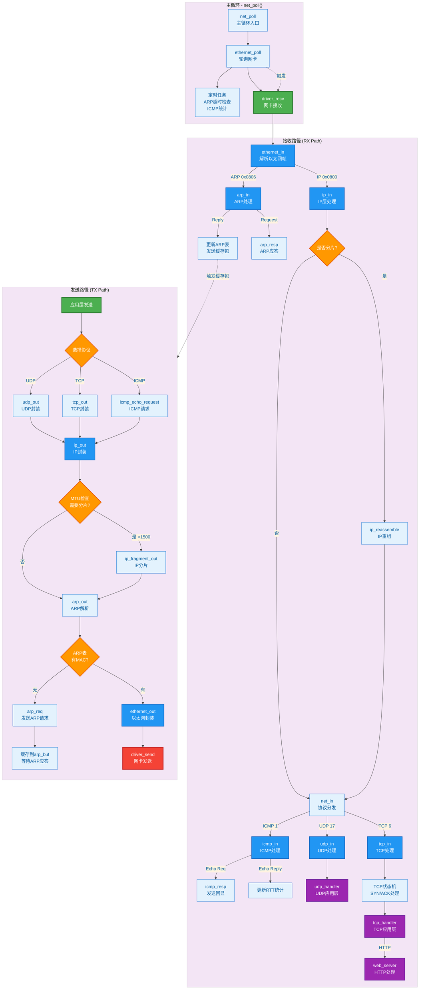

# 计算机网络2025实验 协议栈
- lab 1 虚拟网络配置 
- lab 2 以太网协议
- lab 3 ARP协议
- lab 4 路由器配置
- lab 5 IPv4协议
- lab 6 ICMP协议
- lab 7 UDP协议
- lab 8 IPv6物理过渡配置
- lab 9 TCP协议和Web服务器设计

## 协议栈整体流程图

### 主要函数调用关系说明

**接收路径 (RX)：**
- `driver_recv()` → `ethernet_in()` → 根据协议类型分发
- ARP: `arp_in()` → 更新ARP表 / `arp_resp()` 发送响应
- IP: `ip_in()` → 分片重组（如需）→ `net_in()` → 协议分发
- ICMP: `icmp_in()` → `icmp_resp()` 回显应答 / 统计RTT
- UDP: `udp_in()` → 调用注册的应用层处理函数
- TCP: `tcp_in()` → TCP状态机 → 应用层处理 → Web服务器

**发送路径 (TX)：**
- 应用层 → `udp_out()` / `tcp_out()` / `icmp_echo_request()`
- → `ip_out()` → 分片（如需）→ `arp_out()` 
- → 查ARP表 → `ethernet_out()` → `driver_send()`
- 若无MAC则 `arp_req()` 并缓存包到 `arp_buf`

**主循环：**
- `net_poll()` → `ethernet_poll()` → 轮询接收 + 定时任务处理